<p align="center">
  
</p>

<br>

#  ImpoExpo Recipes TMG 

ImpoExpo Recipes TMG è una web app creata da [TMG IMPIANTI S.p.A.](https://www.tmgimpianti.com/) per poter riuscire ad `esportare` (backup) e `importare` (restore) le ricette delle macchine tramite l'utilizzo del protocollo di comunicazione `OPC-UA`

<br>

## Installazione

1. **Avviare l' .exe -> `Installer TMG ImpoExpo Recipes.exe`**.
    <p align="center">
        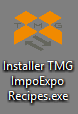
    </p>

    > step 1.1
        <p align="center">
            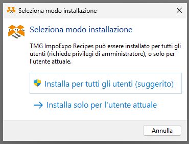
        </p>
    
    >step 1.2
        <p align="center">
            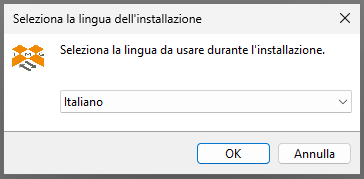
        </p>
        
    > step 1.3
        <p align="center">
            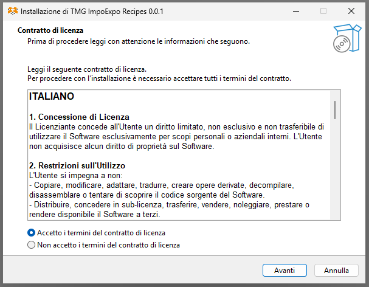
        </p>
    
    >step 1.4
        <p align="center">
            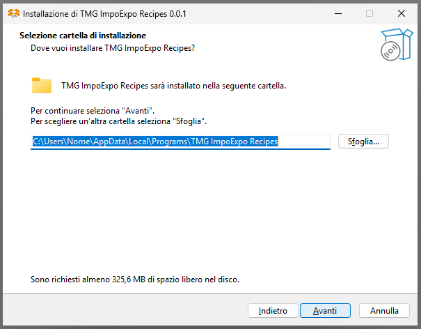
        </p>
        
    > step 1.5
        <p align="center">
            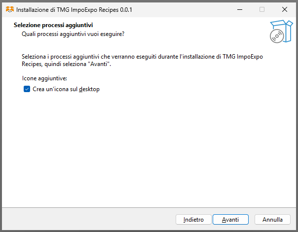
        </p>
    
    >step 1.6
        <p align="center">
            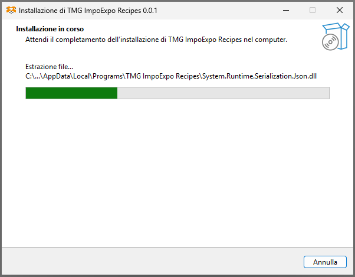
        </p>
        
    >step 1.7
        <p align="center">
            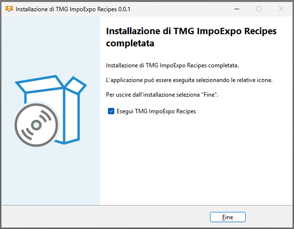
        </p>


2. **Verrà creata la cartella**:
   <br>`TMG ImpoExpo Recipes`
   <br> che conterrà il file `.exe` e `l'unistaller` e tutti i files necessari per far funzionare l'app

3. **la cartella sarà situata nel seguente path**:
   ```bash
   Solo per utente locale:
        C:\Users\[user]\AppData\Local\Programs\TMG ImpoExpo Recipes

   Per tutti gli utenti:
        C:\Program Files (x86)\TMG ImpoExpo Recipes
    ```
4. **In automatico verrà creato il collegamento su desktop**
<p align="center">
    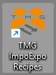
</p>


<br><br>


## Struttura dell'Applicazione
 **Main**
    <br>così è come si presenta l'applicazione
    <p align="center">
    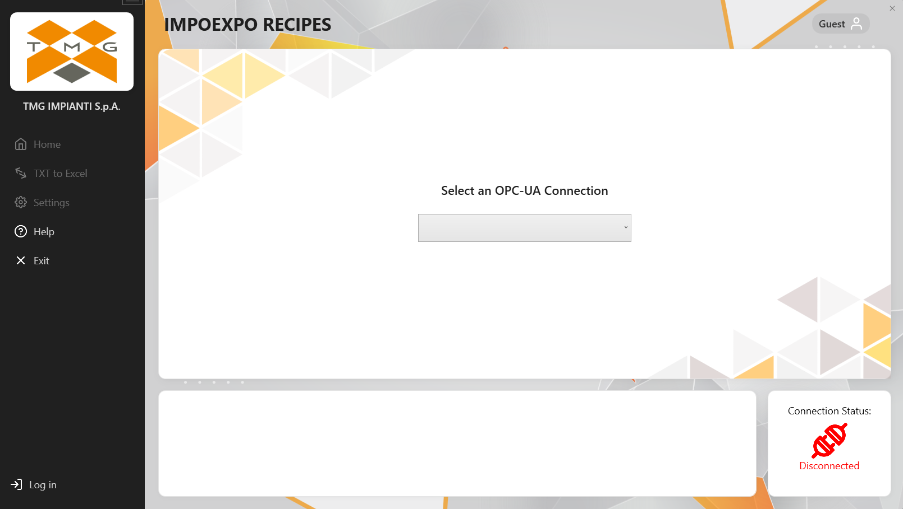
    </p>
    <br>**L'applicazione è suddivisa in 3 sezioni:**

1. **Menu Verticale**
    <br>Permette di scegliere le operazioni che si vogliono eseguire
    <p align="center">
    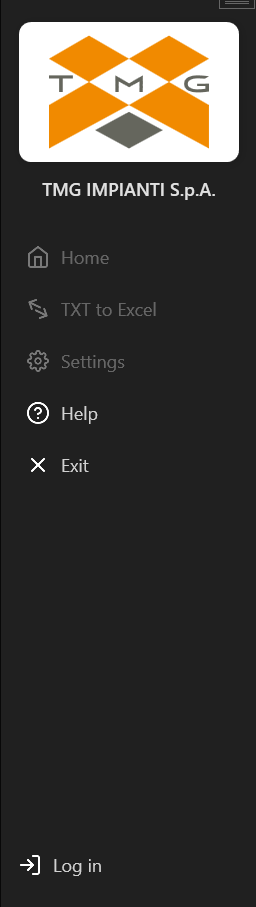
    </p>

2. **Finestra principale**
    <br>Finestra nella quale verranno eseguite tutte le opertazioni
    <p align="center">
    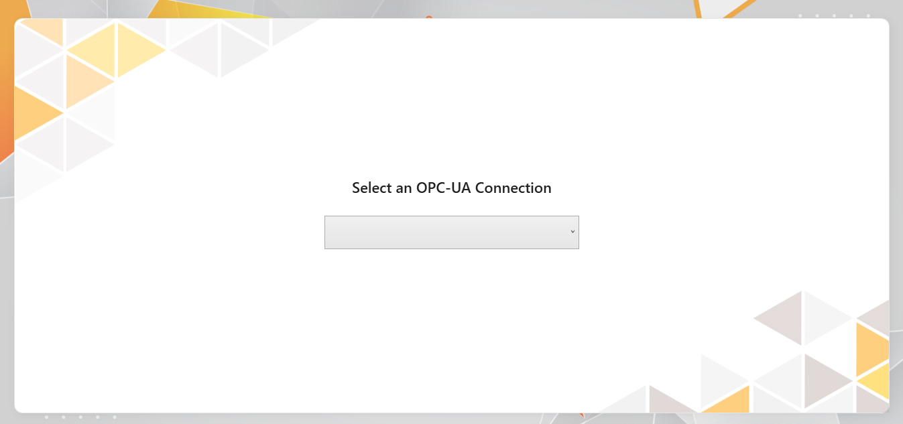
    </p>

1. **Messaggistica e stato connessione**
    <br> Qui verranno mostrati a video gli stati delle operazioni e lo stato di connessione alla macchina
    <p align="center">
    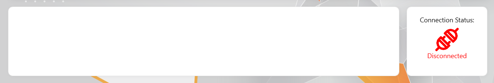
    </p>


<br><br>


## Come funziona ?
1. **Avviare l'app `ImpoExpo Recipe TMG` sul desktop <br> o avviare l' .exe nella cartella**
    ```bash
   Solo per utente locale:
        C:\Users\[user]\AppData\Local\Programs\TMG ImpoExpo Recipes\ImpoExpo_Recipes.exe

   Per tutti gli utenti:
        C:\Program Files (x86)\TMG ImpoExpo Recipes\ImpoExpo_Recipes.exe
    ```

2. **Si aprirà la pagina iniziale**:
    <p align="center">
    
    </p>
3. **Effetuare la connessione tramite OPC-UA**:
   ```
   Eseguire Login       ->  Tramite l'icona dell'utente in alto a destra o la sezione login in basso a sinistra

   Seleziona macchina   ->  Seleziona tramite il menu a tendina la macchina sulla quale connettersi

   NOTA: Menu a tendina vuoto   ->  Andare nella pagina di impostazioni e verificare che ci siano delle configurazioni, vedi sezione SETTINGS
    ```
    Poi premi **`Connect`**
    <br><br>

4. **Connesso ?** :
    <br>Se la connessione andrà a buon fine comparirà un messaggio in verde che indichera la buona riuscirta della connessione e verrà indicato in basso a sinistra lo stato.
    >  **Client Connected Successfully.**

    <p align="center">
    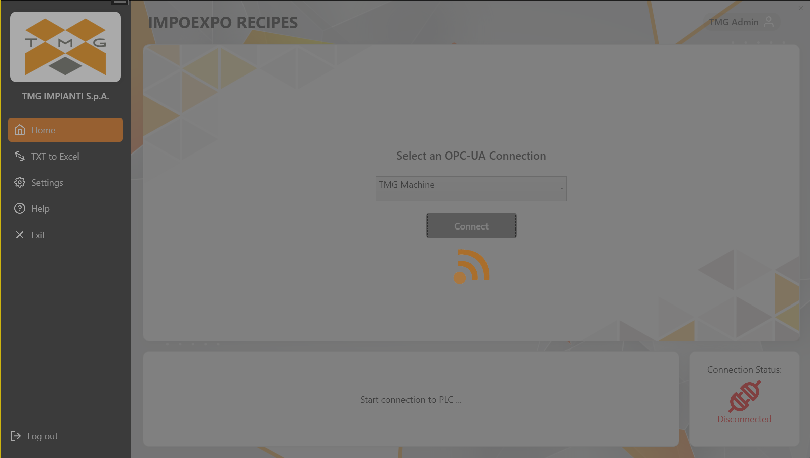
    </p>
    <p align="center">
    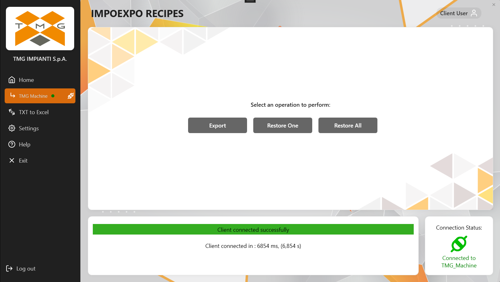
    </p>
    Altrimenti verrà un messaggio di errore in rosso, in base al tipo di errore, con il suggerimento di cosa si ha sbagliato.

<br><br>

## Operazioni
<br>
<p align="center">
    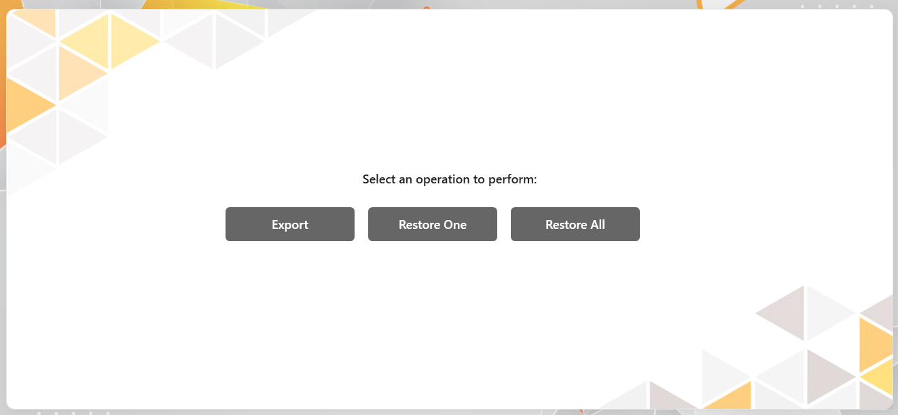
</p>

<br><br>

### EXPORT
Premere il pulsante `EXPORT`

>Si aprirà la pagina di scelta su quale controller operare

<p align="center">
    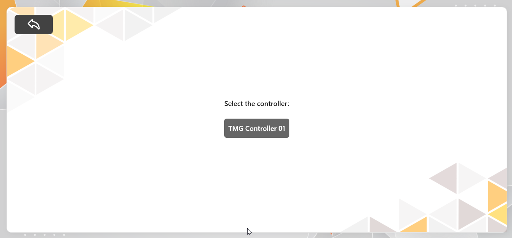
</p>

> Una volta selezionato il controller sul quale operare si aprirà un `popUp di conferma`

Prima di iniziare l'operazione di `esportazione` (backup) vi verrà chiesto dove salvare il file di esporazione:
1. **Path predefinito**:
    In automatico vi verrà mostrato l'ultimo path selezionato:
    ```bash
    C:\Users\[user]\...
    ```

2. **Path personale**:
    volendo potete salvare il file in un'altra cartella dove meglio preferite 
<p align="center">
    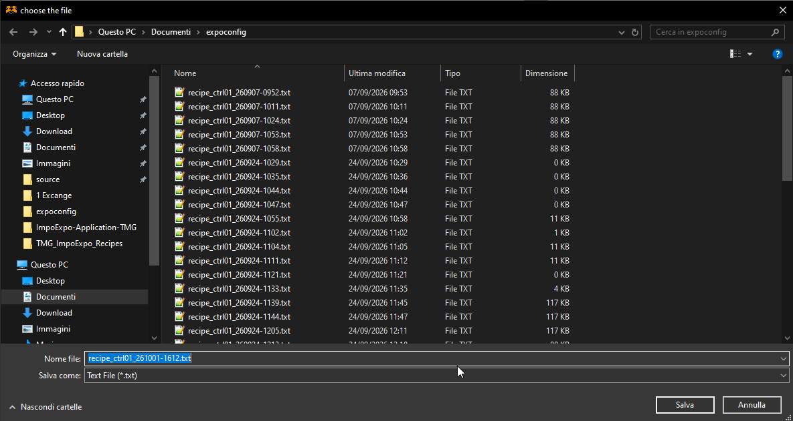
</p>
se si confermerà si avvierà il processo di `esportazione` (backup) di tutte le ricette esistenti.<br>
Fino alla fine dell'operazione nello schermo sarà disabilitato qualsiasi altra possibilità di operazione. Lo schermo dell'applicazione diventerà più scuro e il puntatore del mouse sarà in caricamento.

> **NOTA:** ci sarà sempre in basso al centro i messaggi di stato di cosa sta processando l'applicazione
<p align="center">
    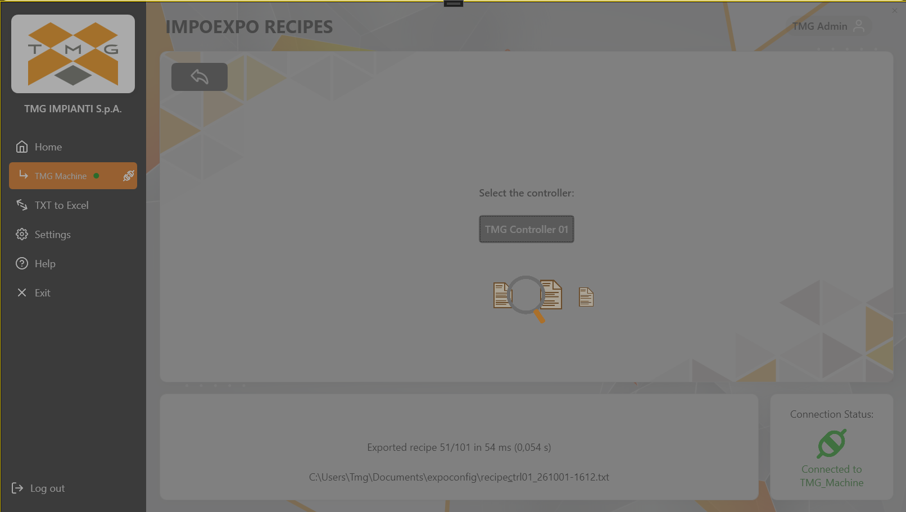
</p>


Salvato il file vi verrà mostrato nei messaggi l'intero path di salvataggio e vi comparirà l'alert di successo.
>Export finished successfully
<p align="center">
    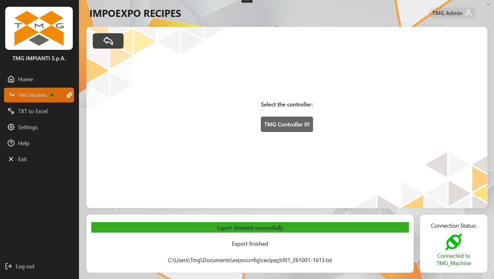
</p>

<br>

### RESTORE ALL
Premere il pulsante `RESTORE ALL` <br>
>Si aprirà la pagina di **RESTORE ALL**
<p align="center">
    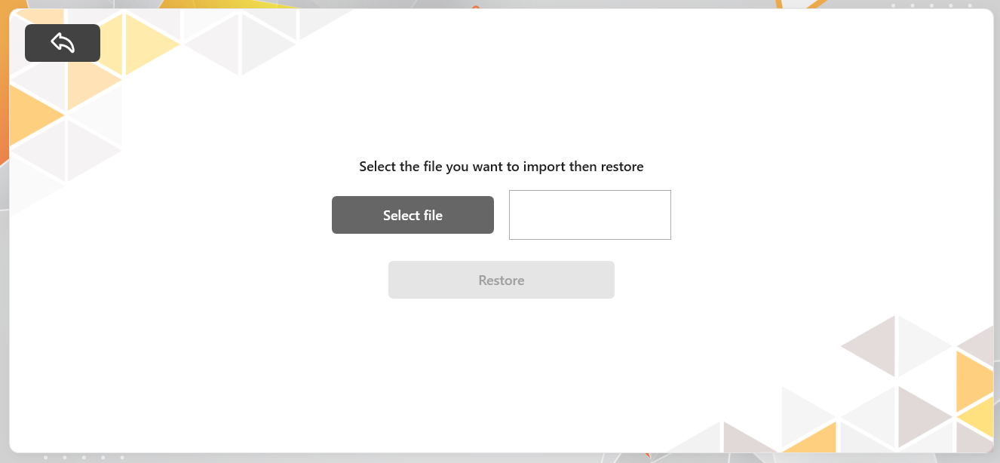
</p>

premete il pulsante **Scegli file** e scegliete il file che volete `importare` (restore) 
> Vi uscirà un PopUp per la scelta del file
1. **Path predefinito**:
    In automatico vi verrà mostrato l'ultimo path selezionato:
    ```bash
    C:\Users\[user]\...
    ```

2. **Path personale**:
    Volendo potete prendere il file in un'altra cartella a vostra scelta dove avete salvato il file in precedenza
<p align="center">
    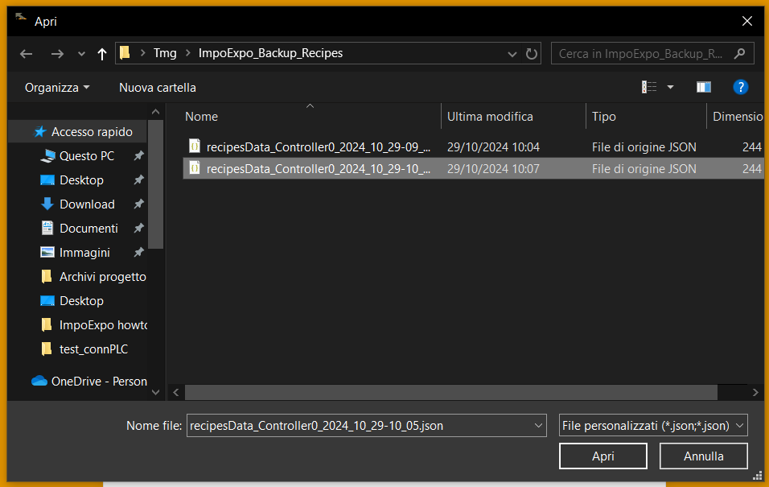
</p>

> **NOTA:** Una volta selezionato il file vi verrà mostrato sullo schermo il path completo del file

<p align="center">
    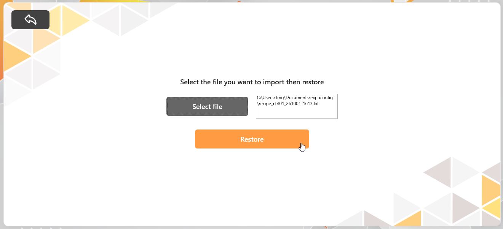
</p>

Premere il pulsante di `Restore`
>Si aprirà un PopUP di conferma dell'azione

Procedere
<p align="center">
    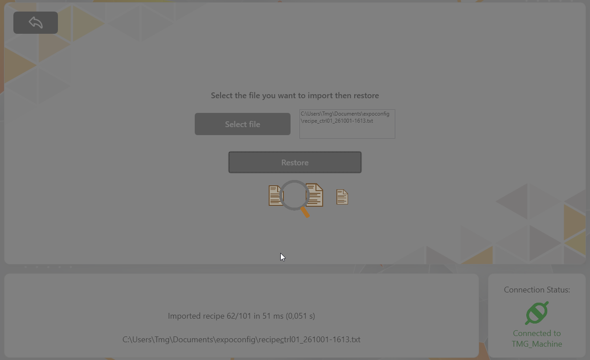
</p>

Una volta confermato si avvierà il processo di `importazione` (restore All) di tutte le ricette esistenti nel file selezionato.<br>
Fino alla fine dell'operazione nello schermo sarà disabilitato qualsiasi altra possibilità di operazione. Lo schermo dell'applicazione diventerà più scuro e il puntatore del mouse sarà in caricamento.
> **NOTA:** ci sarà sempre in basso al centro i messaggi di stato di cosa sta processando l'applicazione

una volta teminato il processo vi comparirà l'alert di successo con i suoi relativi messaggi

<p align="center">
    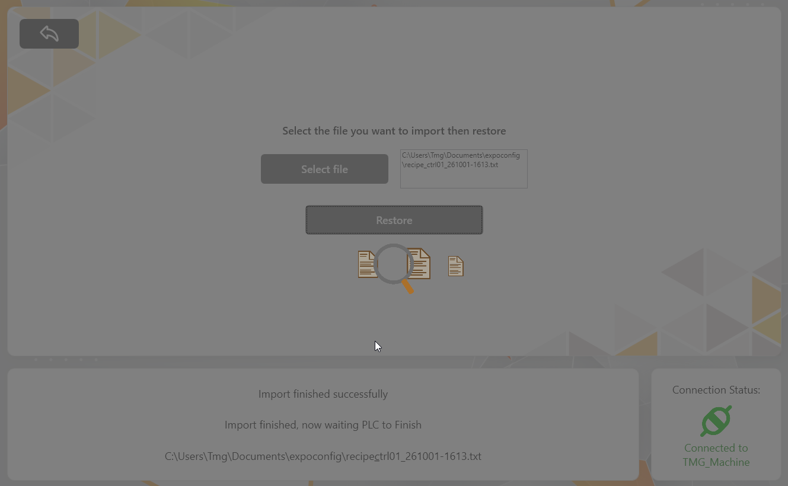
</p>

> Import finished successfully
<p align="center">
    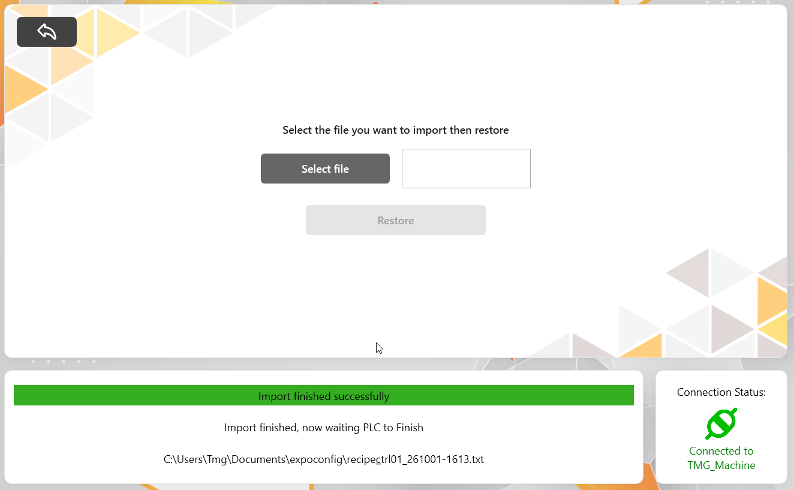
</p>

<br>

### RESTORE ONE
Premere il pulsante `RESTORE` <br>
>Si aprirà la pagina di **RESTORE**
<p align="center">
    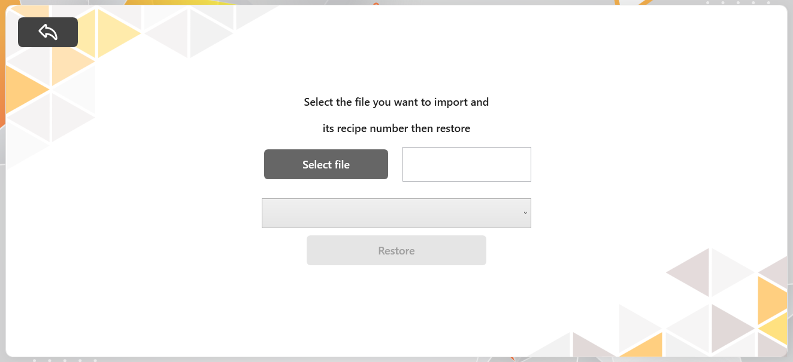
</p>

premete il pulsante **Scegli file** e scegliete il file che volete `importare` (restore) 
> Vi uscirà un PopUp per la scelta del file
1. **Path predefinito**:
   In automatico vi verrà mostrato l'ultimo path selezionato:
    ```bash
    C:\Users\[user]\...
    ```

2. **Path personale**:
    Volendo potete prendere il file in un'altra cartella a vostra scelta dove avete salvato il file in precedenza
<p align="center">
    
</p>

> **NOTA:** Una volta selezionato il file vi verrà mostrato sullo schermo il path completo del file 
```bash
    nel menù a tendina saranno visibili tutte le ricette importabili contenute nel file selezionato
```

<p align="center">
    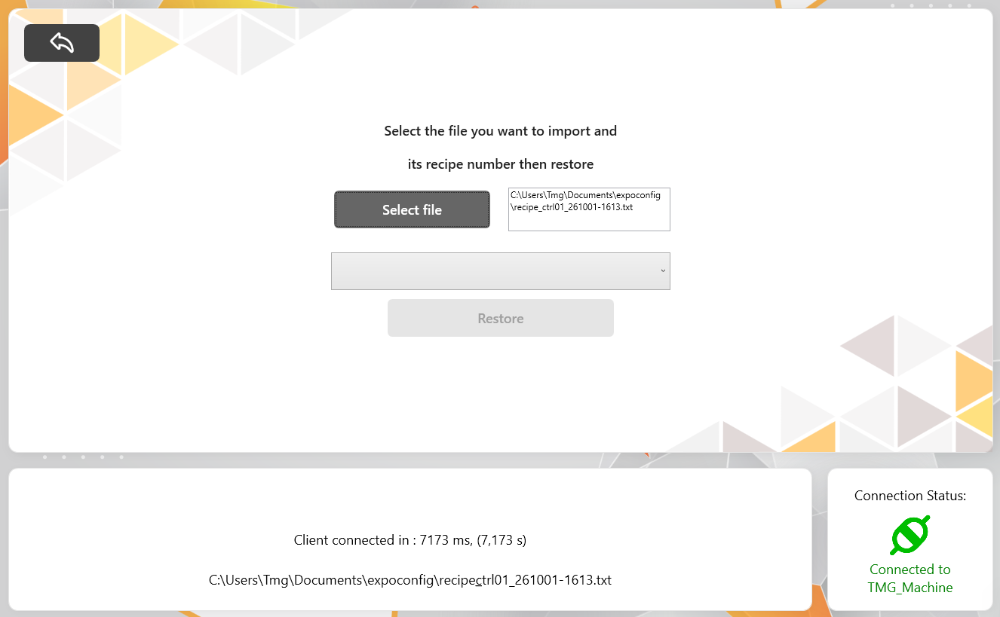
</p>

Selezionare il numero della ricetta che si vuole `importare` (Restore) <br>
e premere il pulsante di `Restore`
<p align="center">
    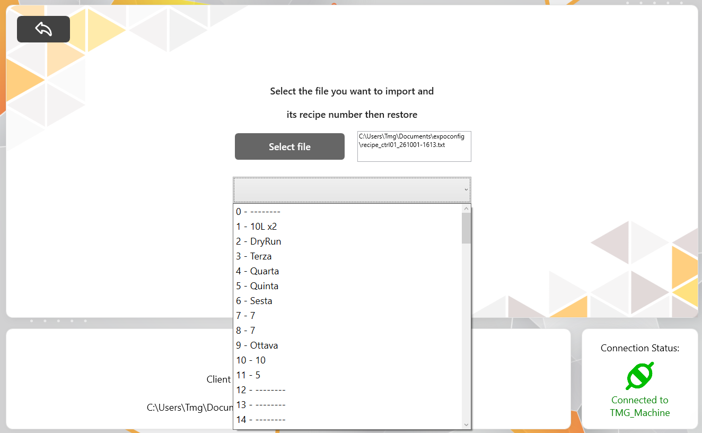
</p>
<p align="center">
    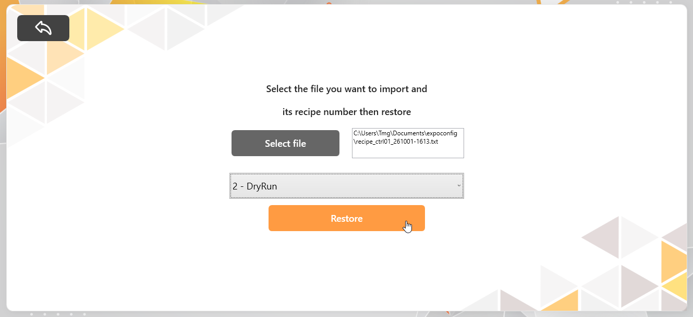
</p>

>Si aprirà un PopUP di conferma dell'azione

Procedere
<p align="center">
    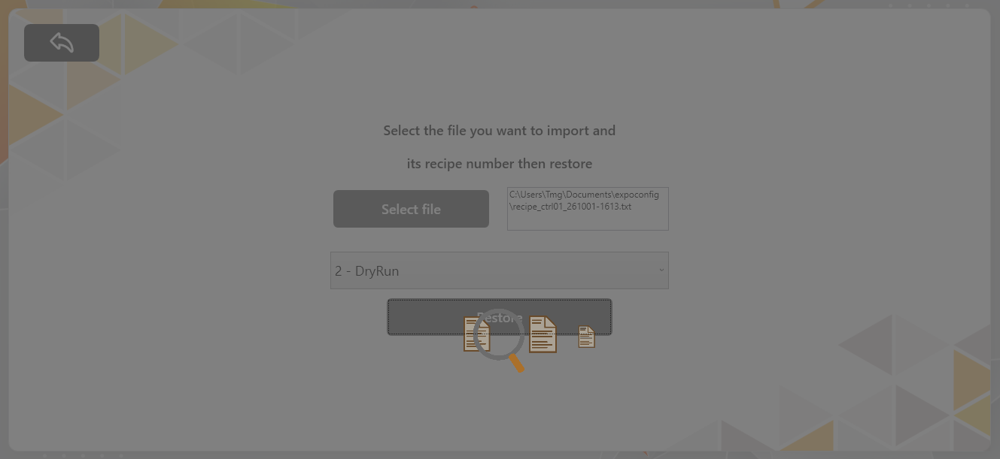
</p>

Una volta confermato si avvierà il processo di `importazione` (restore) del numero della ricetta selezionata del file selezionato.<br>
Fino alla fine dell'operazione nello schermo sarà disabilitato qualsiasi altra possibilità di operazione. Lo schermo dell'applicazione diventerà più scuro e il puntatore del mouse sarà in caricamento.
> **NOTA:** ci sarà sempre in basso al centro i messaggi di stato di cosa sta processando l'applicazione

una volta teminato il processo vi comparirà l'alert di successo con i suoi relativi messaggi

> Import finished successfully
<p align="center">
    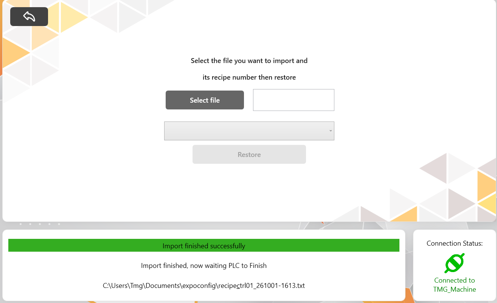
</p>

<br>

## Conversione file da txt to Excel

>Si aprirà la pagina dove sarà possibile inserire il file txt esportato e lo convertirà in un file excel dove i dati saranno più facili da leggere

<p align="center">
    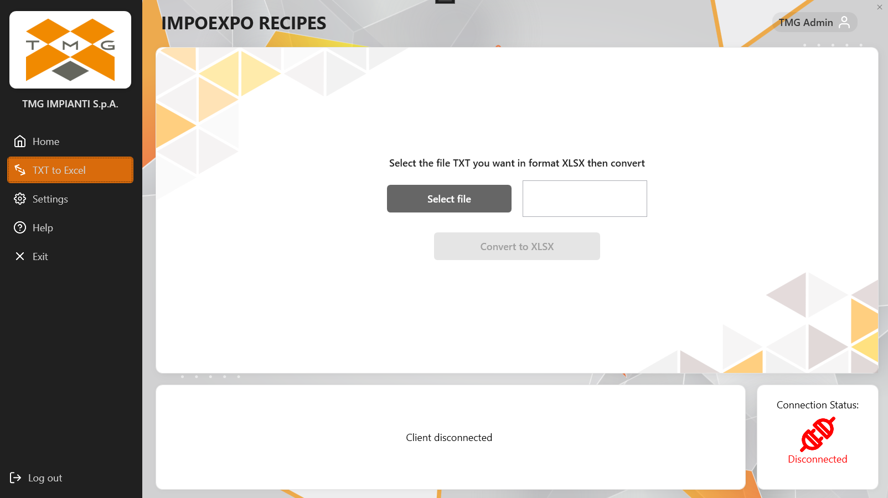
</p>
<p align="center">
    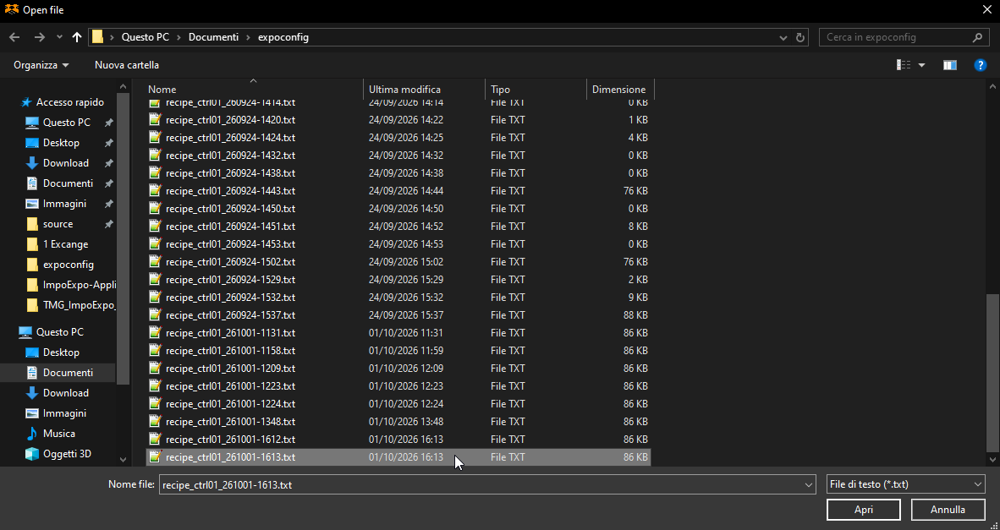
</p>
<p align="center">
    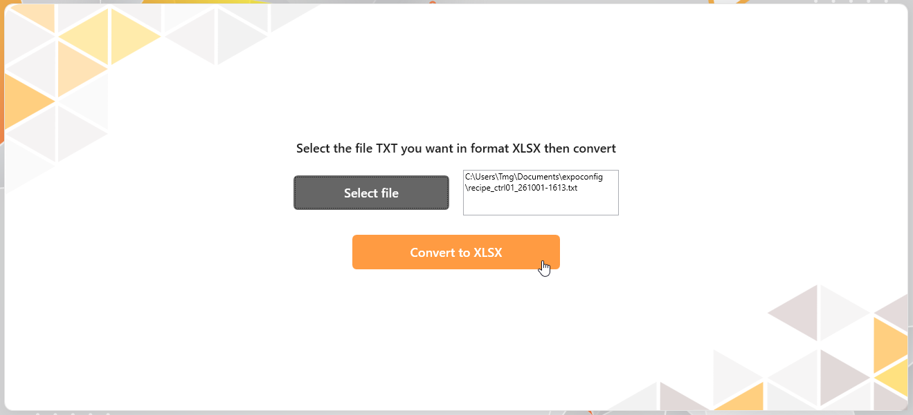
</p>
<p align="center">
    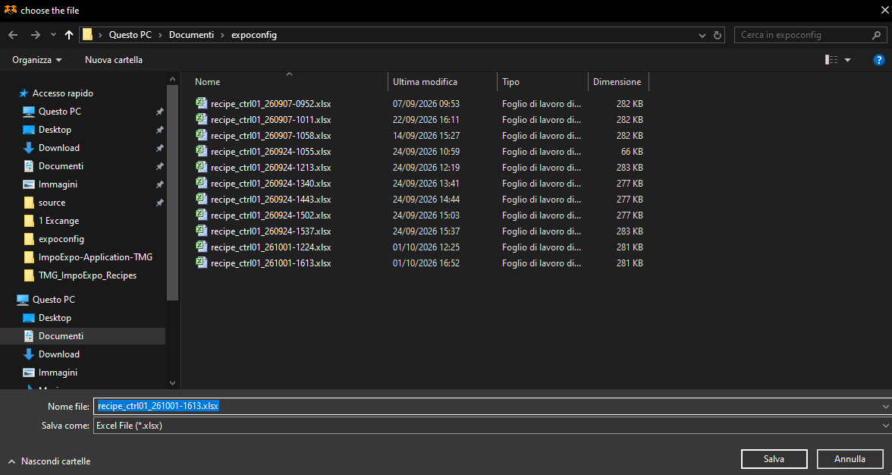
</p>
<p align="center">
    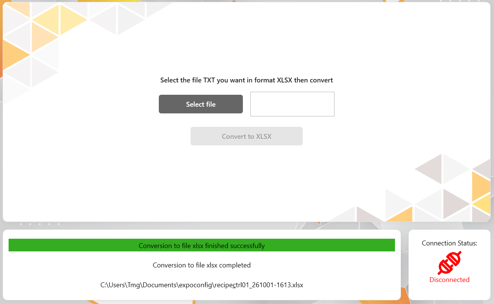
</p>
<br>

## Pulsanti 
- ### Menu Unconnected ->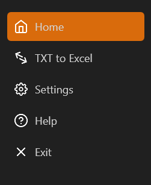Menu Connected ->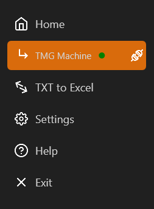 
    1. **Home**
        <br>Ti riporta alla schermata di `Home`, anche quando sei sei connesso ad una macchina, disconnettendoti da quest'ultima.
    2. **[Connected Machine]**
        <br>Ti riporta alla schermata delle operazioni possibili della `[Connected Machine]`
        <br>    2.1. **[Disconnected]** piccola Icona alla fine del pulsante che permette la disconnessione, ti riporterà alla schermata di `Home`
    3. **txt to Excel**
        <br>Ti porta alla schermata di `txtToExcel`, anche quando sei sei connesso ad una macchina
    4. **Settings**
        <br>Ti porta alla schermata di `Settings`, anche quando sei sei connesso ad una macchina,
    5. **Help**
        <br>Ti apre un PopUp che contiene informazioni sull'app e link utili per scoprire il funzionamento dell'app.
    6. **Exit**
        <br>Esce dall'applicazione.

- ### Back<br> 
    Nelle schermate di `Backup`, `Restore` e `Restore All` ti permette di tornare indietro alla selezione dell'operazione da fare
    >è presente anche nelle pagine di `Settings` per tornare indietro

- ### Login<br> +   
    entrambe le selezioni fanno apparire il PopUIp di `Login`
    >  **NOTA:** in alto a destra è possibile visualizzare l'utente con cui si è loggati

<br>


## Help
- `TMG` porta alla pagina web di TMG IMPIANTI S.p.A. per avere contatti
- `LICENSE` porta alla pagina dove viene mostato sotto che tipo di licenza è il software
- `README.MD` porta alla pagina dove viene mostato tutte le info e come si procende nell'utilizzo dell'app
<p align="center">
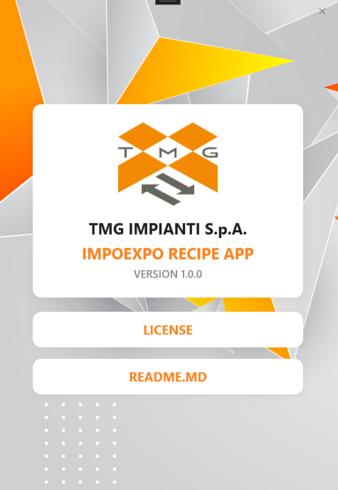
</p>

<br>

## Login
tutte le operazioni sono bloccate da una previa autenticazione, l'app infatti si avvia sempre come `guest` <br>
l'app ha 3 livelli di autorità:
- `Tmg02` Può esesguire tutto
- `Tmg01` e `Client02` Può fare tutto tranne fare le configurazioni manuali ed eliminare le configurazioni nella pagina (`Settings`)
- `Guest` di default all'avvio, può solo consultare la sezione `Help` ed accedere alla sezione di `Login`
<p align="center">
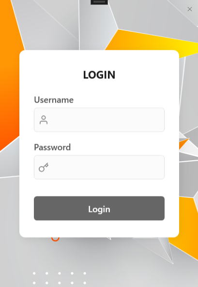
</p>

<br><br>

# Settings

>Come scritto nel capitolo `Login` in questa pagina solo `Tmg02` può esesguire tutto
    
<br>
    una volta effettuato con successo il login si aprira la pagina dove sarà possibile selezionare le opeazioni di configurazione

<br>

<p align="center">
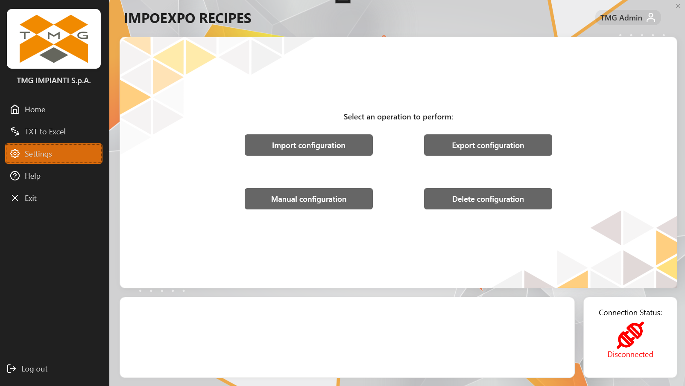
</p>

<br>

### Import Cfg
Si aprirà un PopUp dove sarà possibile selezionare il file di configurazione *`.config`* da importare

> azione possibile a tutti gli utenti autentificati
    
<br>

<p align="center">
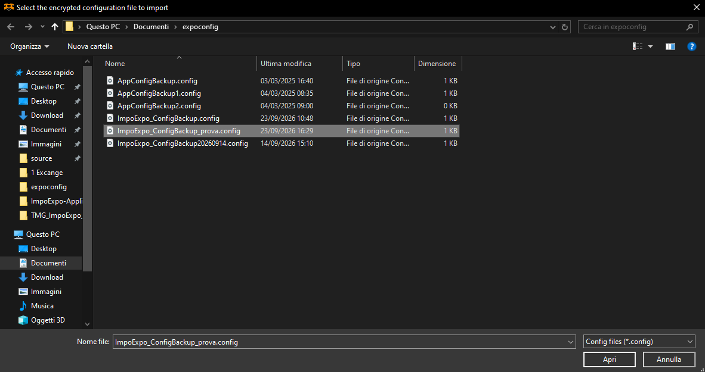
</p>
<p align="center">
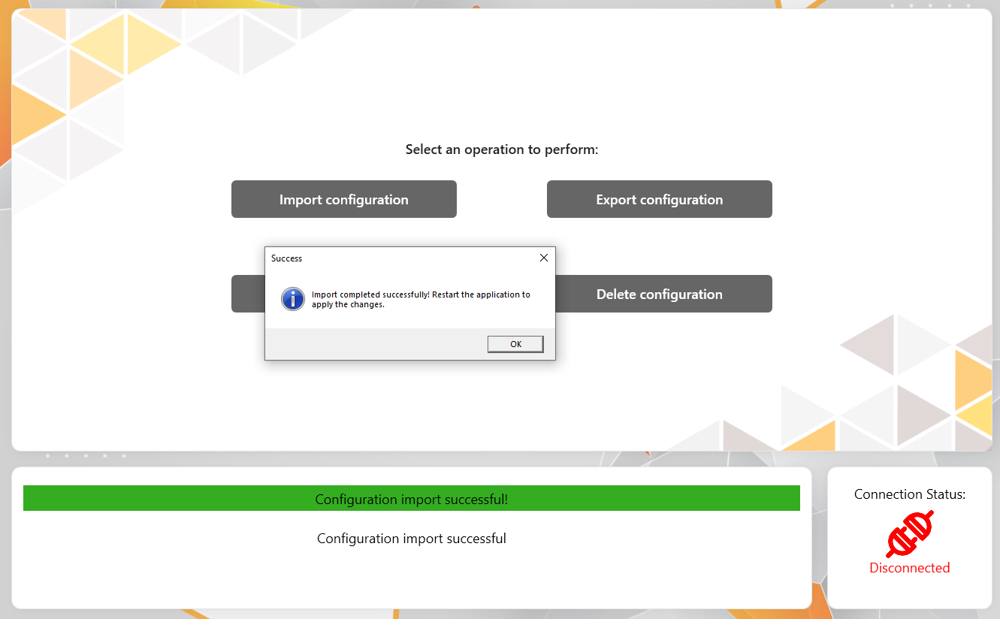
</p>


<br>

### Export Cfg
Si aprirà un PopUp dove sarà possibile selezionare dove salvare in un file *`.config`* l'attuale configurazione presente nell'app 

> azione possibile a tutti gli utenti autentificati

<p align="center">
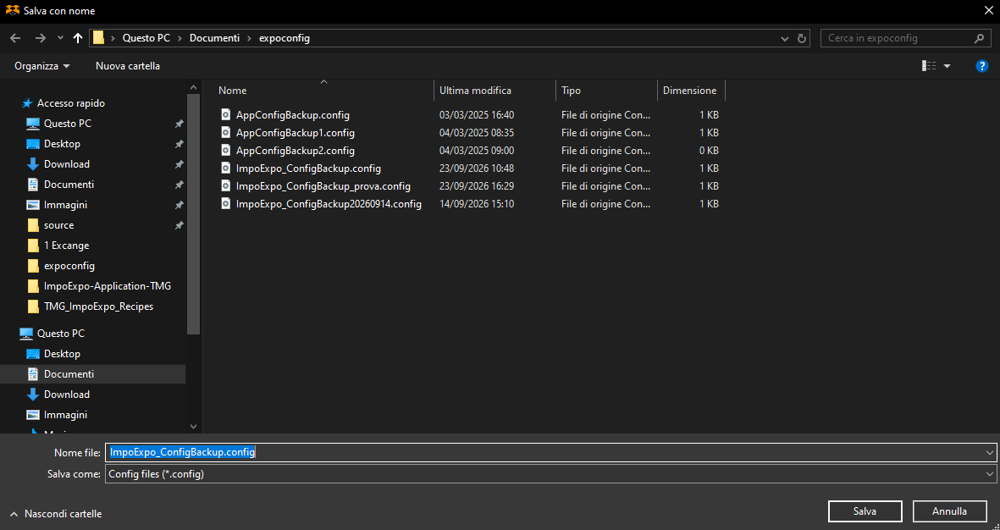
</p>
<p align="center">
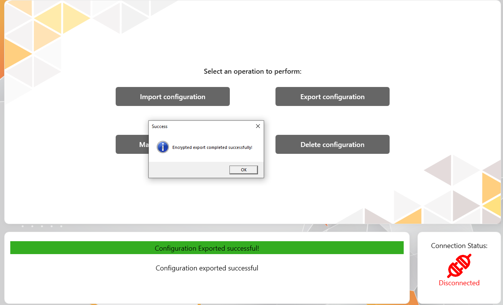
</p>

<br>

### Manual Cfg
Si aprirà la pagina di `Manual` dove sarà possibile manualmente modificare o creare da zero una configurazione

<br>

<p align="center">
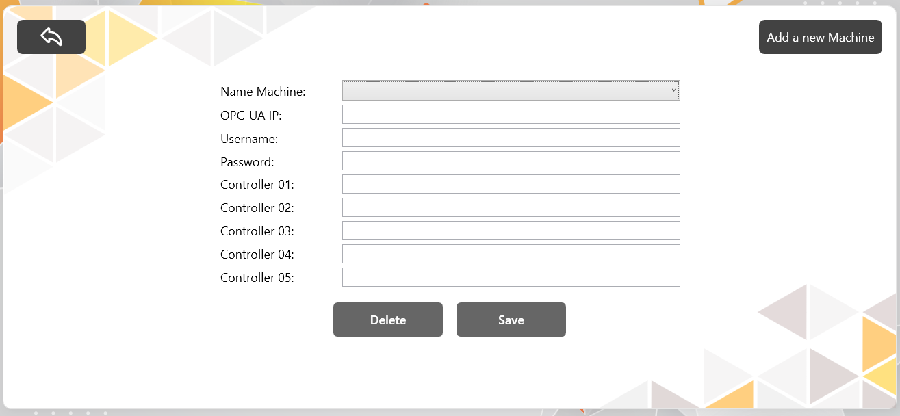
</p>

<br>

Premendo su `Add a new Machine` è possibile impostare da zero i dati necessari per la connessione ad una macchina

<p align="center">
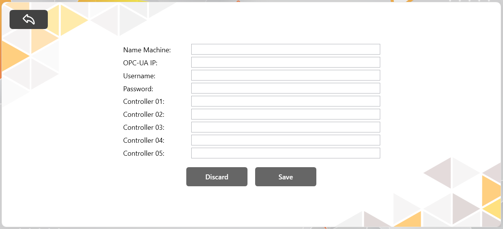
</p>
<p align="center">
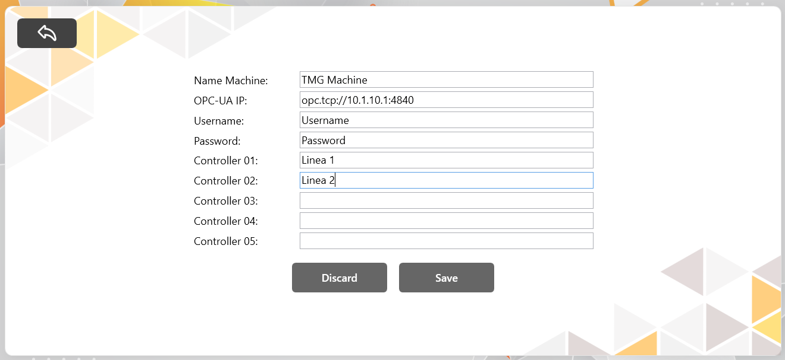
</p>

>una volta compilati i dati correttamente è possibile salvare la configurazione 

verrà notificato nella barra dei messaggi l'avvenuto successo o errore
<p align="center">
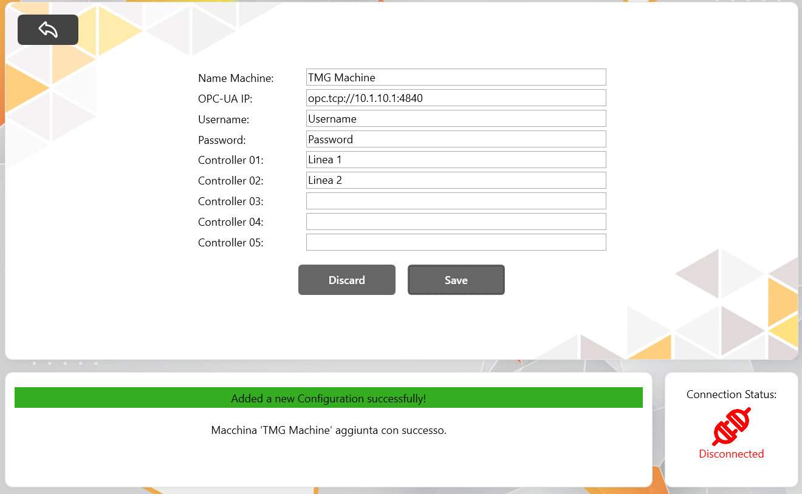
</p>

<br>
<br>

## Config già esistente
Si aprirà la pagina di `Manual` dove sarà possibile modificare la configurazione attuale selezionando la macchina dal menù a tendina

> **NOTA** se il menu a tendina è vuoto significa che non ci sono configurazioni presenti

<br>

<p align="center">
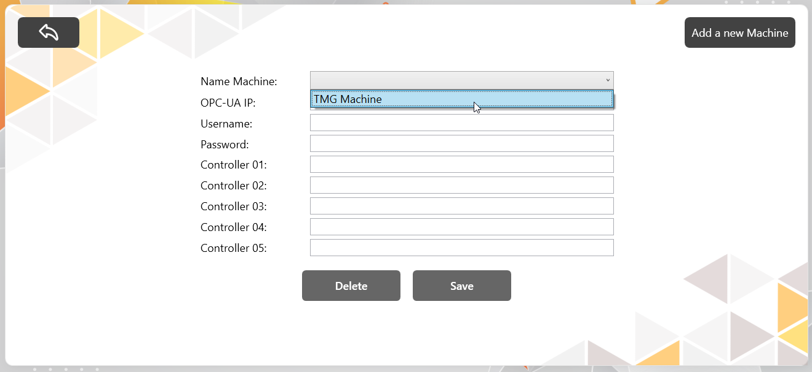
</p>
<p align="center">
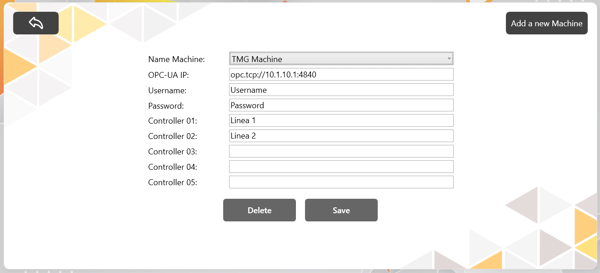
</p>

>una volta modificati i dati correttamente è possibile salvare la configurazione 

<br>

### Save

salva le modifiche fatte o la nuova macchina creata

### Delete

Elimina la macchina selezionata o la nuova macchina che si sta creando

### Discard

Annulla le modifiche fatte sulla nuova macchina creata

<br>

### Delete Cfg
>Si avvierà la funzione di `Delete` dove sarà possibile eliminare la configurazione e ripartire da zero 
<p align="center">
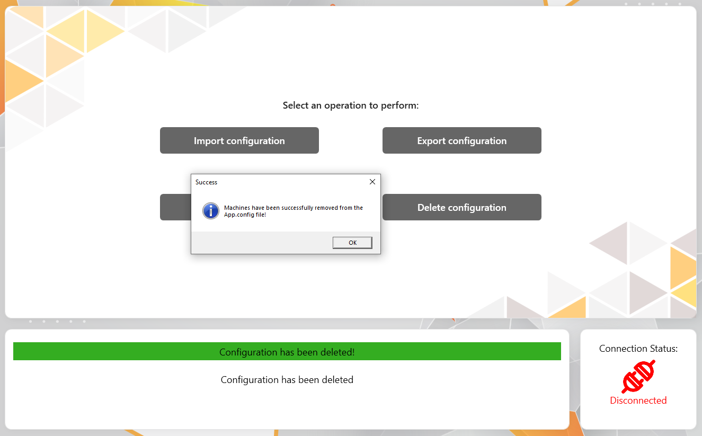
</p>
<br>
